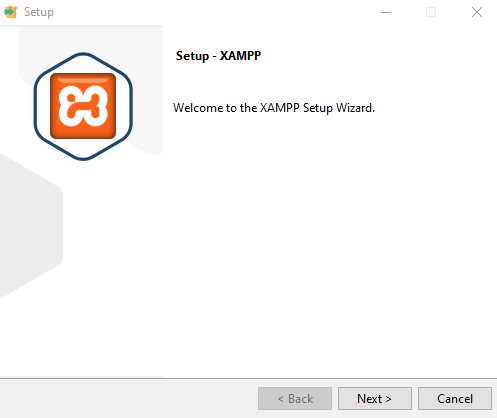
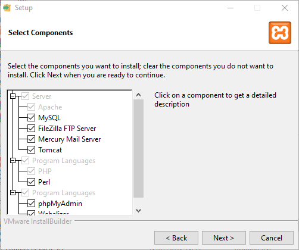
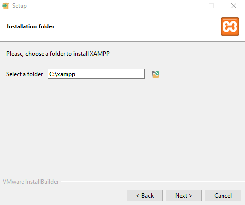
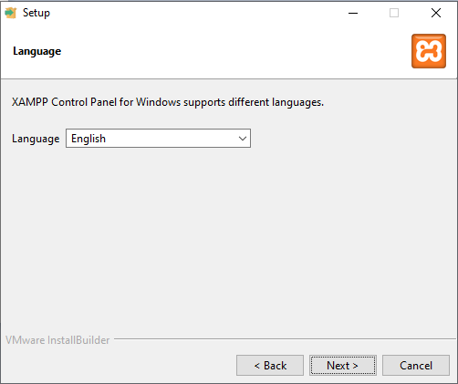
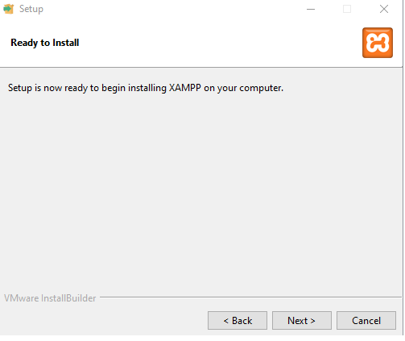
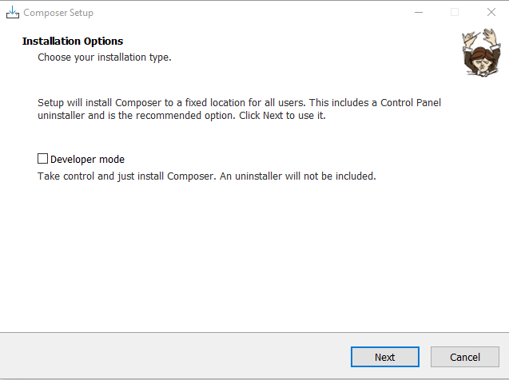
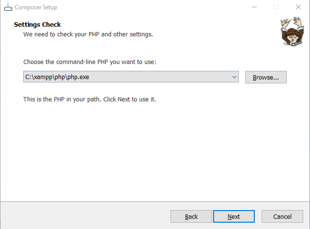
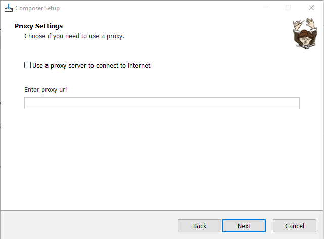
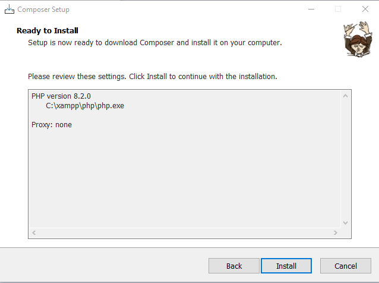

# Backend Finance Cubo's Acadaemy

## Requisitos

1. PHP 8.^
2. Laravel 9.^
3. Composer 2.5.^

## Instalação PHP

Irei ensinar a como instalar o PHP usando XAMPP, por que já matamos a questão do MySQL.

1. [Clique aqui](https://sourceforge.net/projects/xampp/files/XAMPP%20Windows/8.2.0/xampp-windows-x64-8.2.0-0-VS16-installer.exe) para fazer o download da versão 8.2.0 do XAMPP
2. Clique em **Next**


3. Clique em **Next**


4. Clique em **Next**


5. Clique em **Next**


6. Clique em **Next**


Espere a instalação terminar. No final das contas do XAMPP é famoso _full next_ ksks.

## Instalação Composer

1. [Clique aqui](https://getcomposer.org/Composer-Setup.exe) isso vai fazer com que seja baixado a ultima versão do Composer
2. Clique em **Next**

3. Clique em **Next**

4. Clique em **Next**

5. Clique em **Install**



## Clonagem e instalação das dependências
Após tudo isso instalado com sucesso, crie uma pasta para comportar o clone do repositório usando e entre na pasta

```bash
mkdir <nome-repo>
cd <nome-repo>
```

Ao entrar na pasta, execute o seguinte código

```bash
git clone https://github.com/themegazord/backend-project-cubos.git backend
cd backend
```

Isso irá criar uma pasta chamada `backend` e te levará até a mesma.

Dentro, execute o comando para instalar as dependências do projeto.

```bash
composer install
```

## Configurando .ENV

Dentro do arquivo `.ENV` você vai ter que configurar o banco de dados baseado nas seguintes _tags_

```php
DB_CONNECTION=mysql
DB_HOST=127.0.0.1
DB_PORT=3306
DB_DATABASE=financas_cubos
DB_USERNAME=root
DB_PASSWORD=
```
Caso você tenha instalado o XAMPP, apenas altere o nome do banco de dados pela tag `DB_DATABASE` que ta show de bola.


## Inserindo as migrations no banco de dados.

Toda vez que houver atualização, você tera que rodar o seguinte comando

```bash
php artisan migrate:refresh
```

Isso vai fazer com que o Eloquent (ORM do Laravel) de um rollback em todas as tabelas do banco de dados e migre elas novamente.

## Executando o servidor

Com tudo configurado, vamos iniciar o servidor rodando o seguinte comando

```bash
php artisan serve
```

Isso irá criar um servidor na porta 8000 por padrão, caso deseje executar em uma porta especifica, execute

```bash
php artisan serve --port=<numero-da-porta>
```

## Endpoint 

Todas as endpoints da api serão `api/<nome-do-grupo>/<funcionalidade>`

### Grupo Auth

Responsável pelo registro e pelo login do mesmo.

#### api/auth/login 

```json
"method": "POST",
"headers": {
    "Accept": "application/json",
},
"body": {
    "email": "",
    "password": ""
},
"validation": {
    "email": [
        "required",
        "email" //email valido
    ],
    "password": [
        "required"
    ]
},
"return": {
    "isValid": {
        "token": "token sha-256",
        "code": 200
    },
    "isNotValid": {
        "error": "Invalid credentials",
        "code": 401,
    },
    "messageValidation": {
        "email.required" : "O campo email é obrigatório",
        "password.required" : "O campo senha é obrigátorio",
        "email.email" : "O email é inválido",
    }
}
```

#### api/auth/register

```json
"method": "POST",
"headers": {
    "Accept": "application/json",
},
"body": {
    "name": "",
    "email": "",
    "password": ""
},
"validation": {
    "name": {
        "required",
        "max:255",
    },
    "email": {
        "required",
        "email",
        "max:255"
    },
    "password": {
        "required"
    }
},
"return": {
    "isValid": {
        "msg": "User has been created",
        "code": 201
    },
    "isNotValid": {
        "email.unique": "WIP (Work in Process"
    },
    "messageValidation": {
            "name.required": "O campo nome é obrigátorio",
            "email.required": "O campo email é obrigatório",
            "password.required": "O campo de senha é obrigatório",
            "name.max": "O nome deve conter no máximo 255 caracteres",
            "email.max": "O email deve conter no máximo 255 caracteres",
            "email.email": "O email é inválido",
    }
}
```
